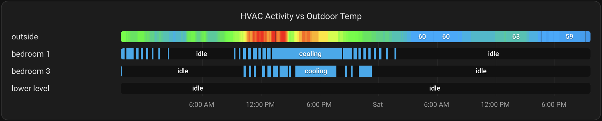
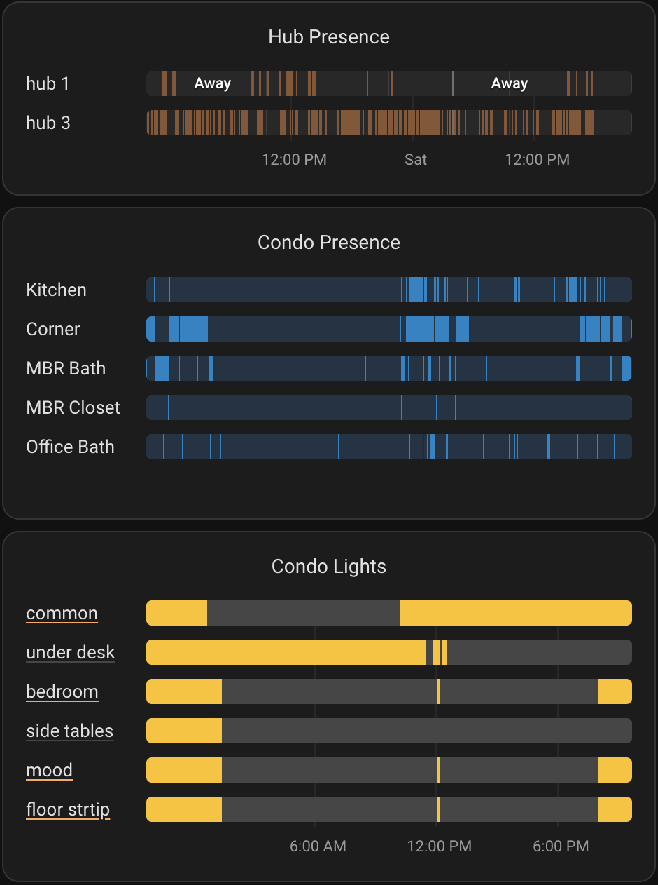

# State History Card

State History Card is a Home Assistant Lovelace card for discrete state history. It is aimed at timelines such as presence, motion, door/window, device tracker, and template sensors where the native history graph is close but you need explicit colors per state value.

It supports:

- Explicit state colors, including raw or translated state aliases such as `on|Home`.
- Optional display label overrides per state.
- Inline labels on long state segments.
- Hover details with state, start, stop, and duration.
- Timeline labels: `on` or `off`.
- Configurable title and legend alignment.
- A visual editor for common options, entity rows, and global state color/label maps.

This card currently targets discrete state timelines. It is not intended to replace numeric line graphs.

## Screenshots





## Installation

### HACS

1. Open HACS in Home Assistant.
2. Search for **State History Card**.
3. Install **State History Card**.
4. Refresh the browser.

If HACS does not list the card, add it as a custom repository:

1. Open the three-dot menu and choose **Custom repositories**.
2. Add this repository URL:

```text
https://github.com/stewartoallen/state-history-card
```

3. Select category **Dashboard**.
4. Install **State History Card**.
5. Refresh the browser.

HACS should add the dashboard resource automatically. If you need to add it manually, use:

```text
/hacsfiles/state-history-card/state-history-card.js
```

Resource type:

```text
JavaScript module
```

### Manual install

1. Copy `state-history-card.js` into:

```text
/config/www/community/state-history-card/state-history-card.js
```

2. Add a dashboard resource:

```text
/local/community/state-history-card/state-history-card.js
```

Resource type:

```text
JavaScript module
```

3. Refresh the browser.

## Example

```yaml
type: custom:state-history-card
title: Presence
title_position: left
title_size: 24px
hours_to_show: 24
refresh_interval: 300
legend: on
timestamps: on
state_colors:
  "on|Home": "#22c55e"
  "off|Away": "#64748b"
  unavailable: "#a1a1aa"
  unknown: "#a1a1aa"
state_labels:
  "on": Home
  "off": Away
entities:
  - entity: binary_sensor.kitchen_presence
    name: Kitchen
  - entity: binary_sensor.office_presence
    name: Office
```

## Options

| Option | Type | Default | Description |
| --- | --- | --- | --- |
| `entities` | list | required | Entity ID strings or objects with `entity` and optional `name`. |
| `title` | string | none | Card title. Omit it to hide the title. |
| `title_position` | string | `left` | `left`, `center`, or `right`. |
| `title_size` | string/number | theme default | CSS font size such as `20px`, `1.1rem`, or a number treated as pixels. |
| `hours_to_show` | number | `24` | History range in hours. |
| `refresh_interval` | number | `300` | Seconds between history API refreshes. |
| `label_width` | string/number | auto | Left entity label column width. Omit for auto-fit, or set a number of pixels, `120px`, `8rem`, or `24%`. |
| `legend` | string | `on` | `on`, `off`, `left`, `center`, or `right`. `on` and `left` are synonyms. |
| `timestamps` | string | `on` | Timeline labels: `on` or `off`. Midnight marks show a weekday or date instead of `12:00 AM`. |
| `state_colors` | object | `{}` | Global state-to-color map. Keys may match raw state, display label, or `|` separated aliases. |
| `state_labels` | object | `{}` | Global raw-state/display-state-to-label map. Keys may use `|` aliases. |
| `color_source` | string | `state` | Global color source for clickable label underlines. Use `light` to use live light attributes when available. |
| `color_stops` | object | none | Global numeric value-to-color stops. Entity-level `color_stops` override this. |
| `null_color` | string | theme background | Color for numeric rows when a value is missing, invalid, or the row has no data. |
| `scale` | number | `1` | Global multiplier for numeric color calculation, displayed numeric labels, and numeric segment merging. Applied before `decimals`. Does not affect the raw value shown in hover details. |
| `decimals` | number | none | Global decimal places for numeric color calculation and display labels. Raw values remain visible in hover details. |
| `entities[].mode` | string | `state` | Set to `numeric` to color numeric sensor history from `color_stops`. |
| `entities[].color_stops` | object | none | Numeric value-to-color stops. Overrides global `color_stops`. |
| `entities[].null_color` | string | global/theme background | Per-entity color for missing or invalid numeric values. |
| `entities[].scale` | number | global/`1` | Per-entity multiplier for numeric color calculation, displayed numeric labels, and numeric segment merging. Applied before `decimals`. |
| `entities[].decimals` | number | global/none | Per-entity decimal places for numeric color calculation and display labels. |
| `entities[].label_action` | object/string | auto | Set to `toggle` or `{ action: toggle }` to make the left entity label toggle the entity. Set to `off` to disable. |
| `entities[].more_info_entity` | string | row entity | Entity to open for label more-info. Useful when a sensor row should open a related thermostat. |
| `entities[].state_colors` | object | none | Per-entity state color map. Overrides global colors for that entity. |
| `entities[].state_labels` | object | none | Per-entity state label map. Overrides global labels for that entity. |
| `entities[].color_source` | string | global/`state` | Per-entity clickable label underline color source. Use `light` for live light attribute color or `state` for graph state colors. |
| `show_legend` | boolean | `true` | Legacy alias. Set to `false` to hide the legend. |

The card also accepts `colors` as an alias for `state_colors`, `labels` as an alias for `state_labels`, and `factor` as an alias for `scale`. Set `labels: "off"` to hide inline state labels.

## State Matching

Home Assistant history stores raw values such as `on`, `off`, `home`, and `not_home`, while the frontend often displays translated labels such as `Home` and `Away`.

State color and label keys can match either form:

```yaml
state_colors:
  "on|Home": "#22c55e"
  "off|Away": "#64748b"
state_labels:
  "on|Home": Present
  "off|Away": Clear
```

To hide labels inside the colored state segments while keeping tooltip and legend labels:

```yaml
labels: "off"
```

Per-entity overrides use the same syntax:

```yaml
type: custom:state-history-card
entities:
  - entity: sensor.ac_state
    state_colors:
      idle: "#64748b"
      cooling: "#0284c7"
      heating: "#dc2626"
```

## Label Actions

For `light`, `switch`, `fan`, and `input_boolean` entities, the left entity label calls `homeassistant.toggle` on short click/touch. Long click/touch opens Home Assistant more-info.

```yaml
type: custom:state-history-card
entities:
  - entity: light.office
    name: Office
```

Use `label_action: off` to disable the short-click toggle for an entity. Use `label_action: toggle` to enable it for another domain.

For entities without a short-click action, clicking the label opens more-info. Set `more_info_entity` to open a related control entity instead of the displayed history entity:

```yaml
entities:
  - entity: sensor.t6_pro_z_wave_programmable_thermostat_with_smartstart_air_temperature
    name: thermostat
    more_info_entity: climate.t6_pro_z_wave_programmable_thermostat_with_smartstart
```

The history bar itself remains dedicated to hover/touch history details.

## Numeric Color Stops

Numeric sensors can render as interpolated color bands:

```yaml
type: custom:state-history-card
color_stops:
  60: "#2563eb"
  68: "#22c55e"
  76: "#facc15"
  82: "#dc2626"
null_color: "#3f3f46"
decimals: 1
entities:
  - entity: sensor.office_temperature
    name: Office temp
    mode: numeric
  - entity: sensor.living_room_temperature
    name: Living room temp
    mode: numeric
    color_stops:
      62: "#2563eb"
      72: "#22c55e"
      84: "#dc2626"
    decimals: 0
```

Numeric rows are omitted from the discrete state legend.

When global `color_stops` are configured, `sensor`, `number`, and `input_number` entities that look numeric use the stops automatically. Use `mode: state` to force a sensor to use discrete state colors.

## Light Color Source

Light rows can use their current reported color for clickable label underlines:

```yaml
type: custom:state-history-card
color_source: state
entities:
  - entity: light.corner
    color_source: light
  - entity: sensor.office_temperature
    mode: numeric
```

Set `color_source: light` globally if most label underlines should use live light colors, then override non-light or discrete rows with `color_source: state`. The history graph itself continues to use `state_colors` or built-in state defaults.

## Visual Editor

The visual editor supports the common card options, entity rows, global state color/label maps, and global numeric color stops. Advanced per-entity `state_colors`, `state_labels`, and `color_stops` remain available through the raw YAML editor.

## Development

Run the syntax check:

```bash
npm run check
```

For local Home Assistant testing, update the dashboard resource URL with a cache-busting query string after each code change:

```text
/local/community/state-history-card/state-history-card.js?v=1
```

Then hard-refresh the Home Assistant browser tab.
